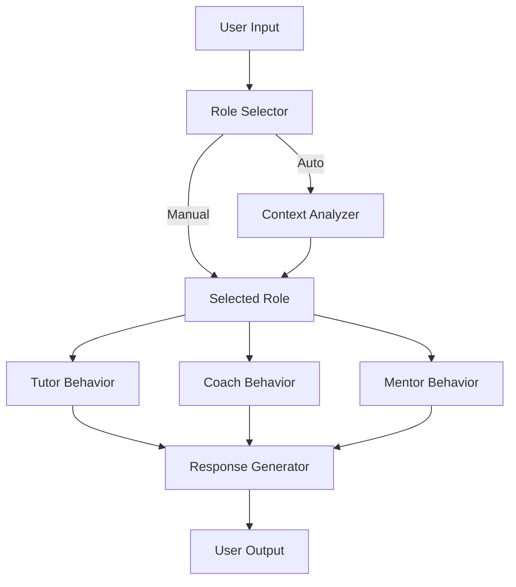

# Assistant Roles: Product Development Guide

> **Purpose**: Define and implement role-based Assistant behaviors for the e-learning application, enabling users to switch between Tutor, Coach, and Mentor modes (or Auto) to match their learning needs.

---

## 🎯 Overview

### Problem Statement

Users need different types of support during study sessions:

- **Understanding concepts** (instruction)
- **Practicing skills** (feedback and drills)
- **Planning and motivation** (guidance)

A one-size-fits-all Assistant cannot optimally address all these needs simultaneously.

### Solution

Implement **role-based Assistant modes** that users can select dynamically. Each role has distinct behaviors, tools, and knowledge domains tailored to specific learning objectives.

---

## ✅ Decisions & architecture fit (2026-06-24)

How this proposal maps onto the **real** Tutor stack, and the decisions taken
(see also the sequenced epic in `product_backlog.md`):

- **A role = a system prompt + an allowed tool set + UI treatment, over ONE
  shared corpus** (the package grounding + `web_search`). No separate per-role
  knowledge bases — same content, different framing/tools.
- **Role *is* the agent.** Roles are `agent_server` presets; the existing agent
  selector becomes the role picker (no second control).
- **Naming:** the app stays **Tutor**; the teaching role is renamed
  **Instructor** (avoids app=role clash). Roles: **Instructor / Coach / Mentor**.
- **Default:** new users start in **Instructor**.
- **Coach grades deterministically** in the browser (the `QuestionPanel` grader);
  the LLM only *explains* — never grades (architecture §1/§7.1).
- **Build order:** the **adaptive trio** (`submit_answer` / `get_grounding` /
  `next_best_question`) + the **per-concept mastery model** are the shared
  foundation (Phase 0); the three roles layer on top (Phase 1); Mentor reminders
  follow (Phase 2). Coach uses the trio; Mentor uses mastery (progress report +
  next-step study plan).
- **No hybrid** (Tutor+Coach) mode — three distinct roles; switching is cheap.
- **Auto mode is deferred** — manual switching first (so the §"Auto Mode",
  §Phase-2/3 ML, and ambiguous-query handling below are **parked**).
- **Parked:** Auto mode (rules → model intent), sentiment analysis, user
  customization of role behaviors, and effectiveness metrics (instrument later).

> The §Auto Mode, §Machine Learning, §Sentiment, and §Open-Questions sections
> below are retained as the **future/parked** design; the sections above are what
> is being built now.

---

## 📌 Role Definitions

### 1. **Tutor Mode**

**Purpose**: *Teach and explain*


| **Aspect**         | **Details**                                                                           |
| ------------------ | ------------------------------------------------------------------------------------- |
| **Primary Focus**  | Conceptual understanding, direct instruction, and answering questions.                |
| **User Intent**    | "Explain this to me," "What does X mean?", "How do I solve this type of problem?"     |
| **Behavior**       | Provides clear, structured explanations. Breaks down complex topics. Uses examples.   |
| **Tools/Skills**   | Step-by-step breakdowns, Q&A, concept mapping, analogies, and theoretical frameworks. |
| **Knowledge Base** | Full curriculum, textbooks, reference materials, and foundational knowledge.          |
| **Tone**           | Patient, precise, and pedagogical.                                                    |


---

### 2. **Coach Mode**

**Purpose**: *Practice and improve*


| **Aspect**         | **Details**                                                                                       |
| ------------------ | ------------------------------------------------------------------------------------------------- |
| **Primary Focus**  | Hands-on practice, error analysis, and skill refinement.                                          |
| **User Intent**    | "Let’s practice," "Am I doing this right?", "Give me feedback on my answer."                      |
| **Behavior**       | Provides exercises, drills, and immediate feedback. Identifies mistakes and suggests corrections. |
| **Tools/Skills**   | Interactive quizzes, error detection, progress tracking, and adaptive drills.                     |
| **Knowledge Base** | Topic-specific exercises, common mistakes, and performance analytics.                             |
| **Tone**           | Encouraging, action-oriented, and constructive.                                                   |


---

### 3. **Mentor Mode**

**Purpose**: *Guide and motivate*


| **Aspect**         | **Details**                                                                                               |
| ------------------ | --------------------------------------------------------------------------------------------------------- |
| **Primary Focus**  | Long-term learning strategy, motivation, and personalized recommendations.                                |
| **User Intent**    | "What should I learn next?", "How do I stay motivated?", "Am I on the right track?"                       |
| **Behavior**       | Offers strategic advice, sets goals, and provides encouragement. Connects concepts to broader objectives. |
| **Tools/Skills**   | Goal-setting frameworks, progress reviews, motivational techniques, and resource curation.                |
| **Knowledge Base** | User’s learning history, pedagogical best practices, and domain-specific roadmaps.                        |
| **Tone**           | Supportive, inspirational, and holistic.                                                                  |


---

## ⚡ Auto Mode

### Purpose

Dynamically select the most appropriate role based on the user’s context, queries, and behavior, removing the need for manual switching while maintaining flexibility.

### Implementation Strategy

#### Phase 1: Rule-Based Triggers (MVP)

Use keyword matching and simple heuristics to determine the role:


| **Trigger Type**         | **Examples**                                                               | **Suggested Role** |
| ------------------------ | -------------------------------------------------------------------------- | ------------------ |
| **Conceptual Questions** | "Explain," "What is," "How does X work?"                                   | Tutor              |
| **Practice Requests**    | "Let’s practice," "Give me a quiz," "Check my answer"                      | Coach              |
| **Strategic Questions**  | "What should I learn next?", "How am I doing?", "Am I ready for the test?" | Mentor             |
| **Performance Patterns** | Repeated errors in exercises                                               | Coach              |
| **Low Engagement**       | Inactivity, lack of progress                                               | Mentor             |


#### Phase 2: Context-Aware Selection

Incorporate additional signals:

- **Session History**: Time spent in each mode, recent actions.
- **User Profile**: Learning goals, past preferences, and skill level.
- **Content Type**: Lesson vs. exercise vs. open-ended exploration.
- **Sentiment Analysis**: Detect frustration (→ Mentor) or curiosity (→ Tutor).

#### Phase 3: Machine Learning (Future)

Train a model to predict the optimal role based on:

- User behavior patterns
- Historical effectiveness of each role for similar users/contexts
- Real-time interaction data

### User Control

- Allow users to **override Auto mode** at any time.
- Provide a **brief explanation** for the selected role (e.g., "Switched to Coach mode because you requested practice").
- Offer **suggestions** (e.g., "You’ve been in Tutor mode for a while—try Coach mode to practice what you’ve learned").

---

## 🔧 Technical Implementation

### Architecture



### Key Components

#### 1. **Role Engine**

- Manages role-specific behaviors, tools, and knowledge bases.
- Ensures consistency in responses for each role.

#### 2. **Context Analyzer** (for Auto Mode)

- **Inputs**: User query, session history, performance data, user profile.
- **Output**: Recommended role (Tutor/Coach/Mentor).
- **Logic**:
  ```typescript
  function determineRole(context: Context): Role {
    if (context.query.includes("explain") || context.query.includes("what is")) {
      return "Tutor";
    } else if (context.query.includes("practice") || context.query.includes("quiz")) {
      return "Coach";
    } else if (context.query.includes("next") || context.query.includes("goal")) {
      return "Mentor";
    } else {
      return context.lastRole || "Tutor"; // Default fallback
    }
  }
  ```

#### 3. **Role-Specific Knowledge Bases**


| **Role** | **Knowledge Base Focus**                                                         |
| -------- | -------------------------------------------------------------------------------- |
| Tutor    | Curriculum, textbooks, reference materials, and foundational knowledge.          |
| Coach    | Exercises, common mistakes, solutions, and adaptive drills.                      |
| Mentor   | Learning paths, motivational content, user progress, and pedagogical frameworks. |


#### 4. **User Interface**

- **Role Selector**: Dropdown or buttons to switch between Tutor, Coach, Mentor, and Auto.
- **Role Indicator**: Visual cue (e.g., icon or color) showing the current mode.
- **Role Explanation**: Tooltip or short description for each role.
- **Auto Mode Feedback**: Optional notifications explaining role switches.

---

## 🎨 User Experience (UX) Guidelines

### Role Selection

- **Default**: Start new users in **Auto mode** or **Tutor mode** (most intuitive for beginners).
- **Discoverability**: Highlight the role selector in onboarding.
- **Flexibility**: Allow users to change roles **mid-session** without losing context.

### Visual Design


| **Role** | **Icon** | **Color**        | **Example Phrase**            |
| -------- | -------- | ---------------- | ----------------------------- |
| Tutor    | 📚 or 🎓 | Blue (#2563EB)   | "Let me explain this to you." |
| Coach    | 🏃 or 🎯 | Green (#10B981)  | "Let’s practice together!"    |
| Mentor   | 🌟 or 🧭 | Purple (#8B5CF6) | "Here’s your next step."      |
| Auto     | ⚡ or 🤖  | Gray (#6B7280)   | "I’ll adapt to your needs."   |


### Example Interactions

#### Tutor Mode

**User**: *"What is the difference between mitosis and meiosis?"*  
**Assistant (Tutor)**: *"Great question! Mitosis and meiosis are both types of cell division, but they serve different purposes. Mitosis results in two genetically identical diploid cells, while meiosis produces four genetically unique haploid cells. Let me break it down further..."*

#### Coach Mode

**User**: *"I answered this biology question but I’m not sure if it’s correct."* (submits answer)  
**Assistant (Coach)**: *"Your answer is close, but you missed a key detail about the role of enzymes. Here’s the correction: [feedback]. Want to try another similar question?"*

#### Mentor Mode

**User**: *"I’m preparing for my biology exam next month. What should I focus on?"*  
**Assistant (Mentor)**: *"Based on your progress, you’ve mastered cell biology but could improve in genetics. I recommend focusing on Punnett squares and pedigree charts this week. Here’s a study plan..."*

---

## 📊 Success Metrics


| **Metric**                      | **Tutor** | **Coach**   | **Mentor**  | **Auto**         |
| ------------------------------- | --------- | ----------- | ----------- | ---------------- |
| User satisfaction (CSAT)        | High      | High        | High        | High             |
| Session duration                | Medium    | High        | Medium      | High             |
| Concept retention (quizzes)     | High      | **Highest** | Medium      | High             |
| Role switch frequency           | N/A       | N/A         | N/A         | Low (ideal)      |
| User engagement (return rate)   | Medium    | High        | **Highest** | High             |
| Accuracy of Auto mode selection | N/A       | N/A         | N/A         | **Target: >85%** |


---

## 🚀 Roadmap

### Phase 1: Core Roles (MVP)

- Define and implement **Tutor**, **Coach**, and **Mentor** behaviors.
- Design role-specific prompts and knowledge bases.
- Build **manual role selector** in the UI.
- Conduct user testing to validate role distinctions.

### Phase 2: Auto Mode

- Implement **rule-based Auto mode** (keyword matching).
- Add **contextual triggers** (e.g., performance patterns).
- Enable **user overrides** and feedback for Auto mode.

### Phase 3: Advanced Features

- Incorporate **sentiment analysis** for role switching.
- Add **personalized recommendations** (e.g., "You’ve been in Tutor mode for 20 minutes—try Coach mode!").
- Develop **ML-based Auto mode** (optional, based on user data).

### Phase 4: Optimization

- A/B test **default roles** and **Auto mode logic**.
- Refine **role behaviors** based on user feedback.
- Expand **knowledge bases** for each role.

---

## 📝 Open Questions

1. Should users be able to **customize role behaviors** (e.g., a stricter Coach or a more patient Tutor)?
2. How should the Assistant **handle ambiguous queries** in Auto mode (e.g., "Help me with this")?
3. Should there be a **hybrid mode** (e.g., Tutor + Coach for a balanced approach)?
4. How can we **measure the effectiveness** of each role beyond user feedback?
5. Should **Mentor mode** include features like study reminders or progress reports?

---

## 🔗 References

- **Pedagogical Frameworks**: Bloom’s Taxonomy (Tutor: Understanding, Coach: Applying/Analyzing, Mentor: Evaluating/Creating).
- **UX Principles**: User control, flexibility, and transparency.
- **Technical**: LLM prompt engineering, context management, and role-specific fine-tuning.
